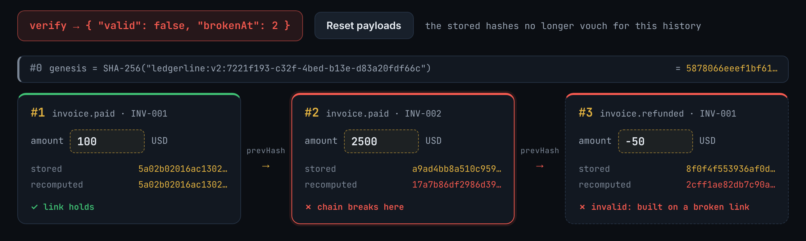
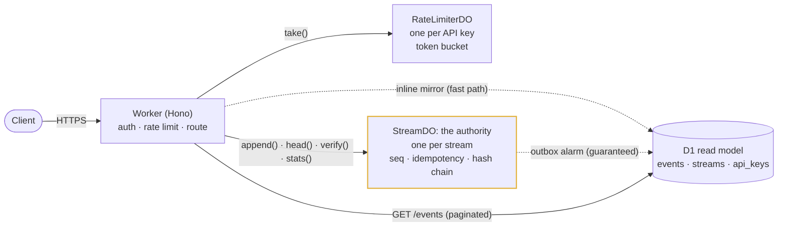
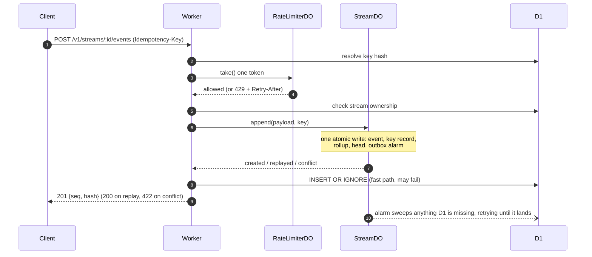

# Ledgerline

**An append-only log that makes rewriting history detectable.** Event streams with exactly-once writes, gap-free ordering, and a tamper-evident SHA-256 hash chain, running on Cloudflare Workers and Durable Objects.

[](https://github.com/aaguasvivas/ledgerline/actions/workflows/ci.yml)


**Live demo:** [ledgerline.adelsonaguasvivas.workers.dev](https://ledgerline.adelsonaguasvivas.workers.dev): edit a recorded hash chain and watch your browser's own recomputation find the broken link.

Designed and built by [Adelson Aguasvivas](https://adelsonaguasvivas.com).

[](https://ledgerline.adelsonaguasvivas.workers.dev/#tamper)

Change one past amount and its recomputed hash no longer matches the stored one; every later link fails too, and `verify` reports `brokenAt: 2`. [Try it live.](https://ledgerline.adelsonaguasvivas.workers.dev/#tamper)

---

## What & why

Ledgerline is a small HTTP API for the write path that ledgers, audit trails, and event-sourced systems depend on. It provides three guarantees:

1. **Exactly-once appends.** Every write carries an `Idempotency-Key`, recorded in the same atomic write as the event. A retry gets the *original* result back and never creates a second event; reusing a key with a *different* body is refused with `422`, so a client bug can't masquerade as a success.
2. **Gap-free per-stream ordering.** Every stream is one Durable Object, a single-threaded actor with its own storage, and the platform runs a single instance of it. Appends serialize into a strictly increasing, gap-free sequence, with no distributed locks and no consensus code in Ledgerline itself.
3. **A tamper-evident audit log.** Each event is linked into a SHA-256 hash chain over [RFC 8785](https://www.rfc-editor.org/rfc/rfc8785) canonical JSON, so changing any past event breaks its link and every link after it. One `GET …/verify` call re-walks the chain and names the first broken event. The spec is public, so a key holder can recompute a chain from `GET …/events` with any RFC 8785 implementation instead of trusting `verify`, and a client holding an earlier `{seq, hash}` can confirm the history it reads up to that seq was not rewritten.

Around that core: a D1 read model fed by a transactional outbox (it can lag, but it can't lose an event), per-key token-bucket rate limiting, and per-minute rollups.

**Engineering highlights**

- **Tests that fail when the mechanism is removed.** The concurrency suite forces the race that `blockConcurrencyWhile` defends against, so deleting the guard makes it fail.
- **Conformance-tested, and versioned.** The canonical form is pinned to RFC 8785's own worked examples, which is how a key-ordering bug in the original canonicalizer surfaced. The fix shipped as a new per-stream chain version, so streams written under the old rule keep verifying.
- **98 tests in the real Workers runtime** (workerd), against real Durable Objects and a local D1. Faults are injected on purpose: a SQL trigger makes D1 reject event inserts, and a 1 ms delay wrapped around the real `crypto.subtle.digest` forces requests to interleave.
- **Failure modes, each pinned by a test.** [One table](#failure-modes) covers lost responses, D1 outages, evictions, appends that land mid-verify, and the consistent rewrite that `verify` cannot catch.

---

## Architecture

The Worker is a stateless front door. The guarantees live in two kinds of Durable Object. D1 holds a queryable copy of every event, written after the Durable Object commits (a [CQRS-style read model](#design-decisions)); the Durable Object stays authoritative. D1 also holds the API keys and stream ownership that every `/v1/streams` request checks.



**The life of an append**



`head`, `verify`, and `stats` always read from the **Durable Object**, so they reflect the true state even when the D1 projection is behind.

---

## Quickstart

**Prefer a terminal?**


Exactly-once in one screen: the retried `Idempotency-Key` returns the original `{seq, hash}` with `Idempotent-Replay: true` and no second event, then one call verifies the whole hash chain.

> **Prerequisites:** Node **≥ 22** (the test runtime, `miniflare`, uses `node:sqlite`). An `.nvmrc` pins it; run `nvm use`.

```bash
git clone https://github.com/aaguasvivas/ledgerline.git && cd ledgerline
npm install

# Local secret for the admin key-minting endpoint (git-ignored).
echo 'ADMIN_SECRET = "local-dev-secret"' > .dev.vars

# Create the local D1 tables, then start the edge runtime locally.
npm run migrate:local
npm run dev                      # → http://localhost:8787 (the demo page is at /)
```

In another terminal, walk the whole API. (`jq` optional, for pretty output.)

```bash
BASE=http://localhost:8787

# 0. Mint an API key (admin-only; the raw key is shown exactly once).
KEY=$(curl -s -X POST $BASE/v1/keys \
  -H 'X-Admin-Secret: local-dev-secret' \
  -H 'Content-Type: application/json' \
  -d '{"name":"demo","rate_per_min":1000}' | jq -r .key)

# 1. Create a stream.
SID=$(curl -s -X POST $BASE/v1/streams \
  -H "Authorization: Bearer $KEY" | jq -r .id)

# 2. Append an event with an idempotency key.
curl -s -X POST $BASE/v1/streams/$SID/events \
  -H "Authorization: Bearer $KEY" \
  -H 'Idempotency-Key: invoice-001' \
  -H 'Content-Type: application/json' \
  -d '{"amount":100,"currency":"USD"}'
# → {"seq":1,"hash":"6d8a9d…"}

# 3. Retry the SAME key and body → original result, no new event, replay header.
curl -si -X POST $BASE/v1/streams/$SID/events \
  -H "Authorization: Bearer $KEY" \
  -H 'Idempotency-Key: invoice-001' \
  -H 'Content-Type: application/json' \
  -d '{"amount":100,"currency":"USD"}' | grep -i 'idempotent-replay'
# → Idempotent-Replay: true

# 4. Reuse the key with a DIFFERENT body → refused, nothing written.
curl -s -X POST $BASE/v1/streams/$SID/events \
  -H "Authorization: Bearer $KEY" \
  -H 'Idempotency-Key: invoice-001' \
  -H 'Content-Type: application/json' \
  -d '{"amount":99999,"currency":"USD"}'
# → {"error":{"code":"idempotency_key_reused",…}}   (HTTP 422)

# 5. Read the O(1) head and verify the whole chain.
curl -s $BASE/v1/streams/$SID/head   -H "Authorization: Bearer $KEY"
# → {"count":1,"headHash":"6d8a9d…","chainVersion":2}
curl -s $BASE/v1/streams/$SID/verify -H "Authorization: Bearer $KEY"
# → {"valid":true}
```

---

## API reference

All `/v1/streams/*` endpoints require `Authorization: Bearer <api-key>` and are rate-limited per key. Errors use a uniform envelope:

```json
{ "error": { "code": "stream_not_found", "message": "Stream not found" } }
```

Status codes: `400` bad request · `401` unauthenticated · `403` admin-forbidden · `404` not found / not owned · `413` payload too large · `422` idempotency key reused with a different payload · `429` rate-limited · `500` internal error (for example, D1 unreachable).

### `GET /health`
Liveness probe; unauthenticated. → `{ "status": "ok" }`

### `POST /v1/keys`: mint an API key (admin)
Guarded by `X-Admin-Secret: <ADMIN_SECRET>` (fails closed when the secret is unset). The raw key is returned **once** and only its SHA-256 hash is stored. An empty body mints with defaults (`name: "unnamed"`, `rate_per_min: 60`); a non-empty body must be a JSON object (`400 invalid_body`).

```bash
curl -X POST $BASE/v1/keys -H 'X-Admin-Secret: …' \
  -H 'Content-Type: application/json' -d '{"name":"acme","rate_per_min":120}'
# → 201 {"key":"lk_…48hex…","name":"acme","rate_per_min":120}
```

### `POST /v1/streams`: create a stream
```bash
curl -X POST $BASE/v1/streams -H "Authorization: Bearer $KEY"
# → 201 {"id":"6f729257-d269-4f02-a3b4-7b651a966ae1"}
```

### `POST /v1/streams/:id/events`: append
Requires header `Idempotency-Key`; the body is an arbitrary JSON payload.

```bash
curl -X POST $BASE/v1/streams/$SID/events -H "Authorization: Bearer $KEY" \
  -H 'Idempotency-Key: k1' -H 'Content-Type: application/json' -d '{"note":"hello"}'
# → 201 {"seq":2,"hash":"68984989…"}
```

| Request | Response |
|---|---|
| New key | `201 {seq, hash}` |
| Repeated key, same payload (compared in canonical form, so key order and whitespace don't matter) | `200 {seq, hash}` of the **original** event + `Idempotent-Replay: true`; nothing written |
| Repeated key, different payload | `422 idempotency_key_reused`; nothing written (as the [IETF Idempotency-Key draft](https://datatracker.ietf.org/doc/draft-ietf-httpapi-idempotency-key-header/) specifies) |
| Missing key / key over 256 chars | `400 idempotency_key_required` / `400 idempotency_key_invalid` |

- **Limits** (explicit product caps, enforced as typed errors at the edge): body ≤ 256 KiB, counted while streaming so an oversized upload is never buffered (`413 payload_too_large`); nesting ≤ 64 levels (`400 payload_too_deep`); valid UTF-8, finite numbers, and no unpaired UTF-16 surrogates (`400 invalid_payload`). The last two keep every accepted payload representable in RFC 8785: JSON `1e999` would otherwise silently become `null`.
- Idempotency keys are retained for the **life of the stream**: a key permanently maps to its original event, so retries are safe at any later time, unlike TTL-based schemes.

### `GET /v1/streams/:id/events?after=<seq>&limit=<n>`: paginated read (D1)
`after` defaults to `0`, `limit` defaults to `50` (max `200`).
```json
{
  "events": [
    { "seq": 1, "hash": "6d8a9d…", "prevHash": "90bc43…",
      "payload": { "amount": 100, "currency": "USD" }, "createdAt": 1782806126825 }
  ],
  "nextAfter": null
}
```
`nextAfter` is the last `seq` when a full page was returned, otherwise `null`. A page ends at the first seq the read model has not received yet, so following `nextAfter` (or your last seq) never skips an event; a short page can mean caught up for now. If the authority itself lost an event, `verify` reports it as `brokenAt` and pages stop there until you pass a later `after` explicitly.

### `GET /v1/streams/:id/head`: O(1) head (Durable Object)
→ `{ "count": 2, "headHash": "68984989…", "chainVersion": 2 }`
(`chainVersion` is the [hash-chain rule version](#versioning) the stream was created under.)

### `GET /v1/streams/:id/stats`: per-minute rollups (Durable Object)
→ `{ "total": 2, "perMinute": [ { "minute": 29713435, "count": 2 } ] }`
(`minute` = `floor(epochMs / 60000)`; only the last 60 minutes with activity are returned.)

### `GET /v1/streams/:id/verify`: recompute the chain (authoritative)
Re-walks the chain from genesis over the Durable Object's events and reports the first seq that is missing, out of order, or fails to link; then checks the result against the stream's committed head, so **tail truncation** (the classic ledger rollback) is caught too.
→ `{ "valid": true }` or `{ "valid": false, "brokenAt": 2 }`

---

## The hash chain (precise spec)

Tamper-evidence is fully specified and versioned, so anyone holding a stream's events can recompute and audit its chain independently:

```
canonical JSON   = RFC 8785 (JSON Canonicalization Scheme)
hash_0 (genesis) = SHA-256("ledgerline:v2:" + streamId)                          (hex)
hash_n           = SHA-256(hash_{n-1} + "|" + canonicalJSON(payload_n) + "|" + n)  (hex)
```

Each stored event keeps both `prevHash` and `hash`. `verify` walks from genesis and, for every event, checks that its `seq` is the next one, that its stored `prevHash` equals the recomputed previous hash, and that its stored `hash` equals the recomputed link. The first failure is `brokenAt`. It then compares the recomputed head with the stream's committed head (count + head hash), so a **truncated tail** is reported too. Because every link folds in the previous hash, altering event *k* invalidates *k* and everything after it.

`createdAt` is server wall-clock metadata and is not hashed: the chain attests to content and order, not time, so an edited timestamp passes `verify`.

**For external verifiers.** Use any RFC 8785 implementation; the canonical form is pinned by the RFC's own worked examples plus known-answer SHA-256 vectors in `test/hash.test.ts`. In particular:
- Object members are sorted by key in **UTF-16 code-unit** order, numeric-string keys included (`"10"` sorts before `"9"`).
- Strings are serialized as ECMAScript `JSON.stringify` emits them, with non-ASCII characters unescaped (`"héllo 🚀"`).
- Numbers use ECMAScript number-to-string form (`-0` → `0`, `1e21` → `1e+21`, `1.5e-7` → `1.5e-7`); integers beyond 2^53 lose precision at `JSON.parse`, like in any JS service.
- Python's `json.dumps(sort_keys=True)` is **not** a substitute: it writes `1.5e-07` and sorts keys outside the Basic Multilingual Plane differently. Use an RFC 8785 library.

### What verify catches, and what it cannot

`GET …/verify` runs on the server that stores the chain. It catches changes that bypass the append path: a direct storage write, a bad migration, a bug that rewrites an event, a lost tail. It cannot catch an operator who rewrites every event and the head consistently; `verify` passes, and [a test](test/stream-do.test.ts) pins that boundary. Catching it takes a hash held outside the server: every append returns `{seq, hash}`, and a client that kept the hash for seq *k* can recompute the chain from `GET …/events` and detect any rewrite of events 1 through *k* in the history it reads.

### Versioning

The rules are versioned **per stream**: a stream records the version it was created under (reported as `chainVersion` by `GET …/head`) and keeps it for life, so changing the rules never re-judges existing history.

| Version | Canonical form | Genesis prefix |
|---|---|---|
| **2** (current) | RFC 8785 | `ledgerline:v2:` |
| 1 | keys re-sorted, then `JSON.stringify`; engines put integer-like keys (`"9"`, `"10"`) first in numeric order, the one place it differs from RFC 8785 | `ledgerline:v1:` |

v1 streams keep appending and verifying under v1 rules. Putting the version in the genesis prefix means a v1 chain and a v2 chain can never be mistaken for one another. Known-answer vectors for both versions, cross-checked against an independent implementation, are pinned in `test/hash.test.ts`.

---

## Design decisions

**Why a Durable Object gives ordering + exactly-once without distributed locks.**
A Durable Object is a single-threaded actor with its own consistent storage, so two appends to one stream never run in parallel. The remaining hazard is *interleaving across `await`s*: an append reads `meta`, awaits a SHA-256 digest, then writes. Durable Object input gates already hold new requests back during storage operations, and in workerd today a `crypto.subtle` digest doesn't open the gate either, but that is a runtime detail, not a contract. Ledgerline makes atomicity explicit by running each mutation in `ctx.blockConcurrencyWhile(...)`, and the test suite forces the digest to yield so the guard is actually exercised: without it, 20 concurrent appends collapse onto duplicate sequence numbers. The event, idempotency record, rollup bucket, head, and outbox alarm are written with no `await` in between, so they commit as one atomic write.

**The consistency model.**
The Durable Object is the **source of truth**; D1 is an **eventually-consistent projection**:
- Writes need strong ordering and atomicity → Durable Object.
- Reads need SQL and cursor pagination → D1/SQLite.

Projection uses a **transactional outbox**. Every append arms a Durable Object alarm in the same atomic write as the event, unless a sweep is already pending. The alarm reconciles D1 against the log from a confirmed watermark: one `SELECT` per 500 seqs asks D1 which rows it already holds, and only the missing ones are inserted, so catching up after an outage costs a query per window plus one insert per event actually lost, not one per event since the watermark. Each sweep stays inside a fixed D1 query budget (under the Workers Free per-invocation limit) and continues in a fresh invocation if work remains; progress comes from seq arithmetic, so a damaged event can't stall it. On failure the sweep reschedules itself instead of throwing, because platform alarm retries are finite and a D1 outage might not be. The Worker also mirrors inline right after each append, so a read immediately after a write usually sees it. Both writers use `INSERT OR IGNORE` keyed on `(stream_id, seq)`, so whichever lands second is a no-op. A failed inline write is logged (`mirror_deferred`) and the client still gets its authoritative `{seq, hash}`: failing the request over a non-authoritative projection would tell the client its durable write didn't happen.

**Why idempotency keys give exactly-once, and why a mismatched body is a 422.**
"Exactly-once delivery" is impossible over an unreliable network, but **exactly-once *effect*** is achievable: make the write idempotent and let the client retry. The Durable Object stores `idem:{key} → {seq, hash}` in the same atomic commit as the event. A retry with the same payload short-circuits to the stored result. A retry with a different payload almost always means a client bug (a recycled counter, a key derived from the wrong field); answering it with the original result would tell that client a write succeeded when it never happened, so it is a `422`, as the IETF draft specifies; Stripe likewise refuses to replay such a request. Records never expire: unlike TTL-based schemes (Stripe may prune a key once it is 24 hours old), a key is reserved for the stream's lifetime, so storage grows with the event log the ledger keeps anyway.

**Auth that doesn't leak.**
API keys are stored only as SHA-256 hashes. Stream ownership is enforced on every request, and a caller asking about a stream it doesn't own receives `404`, not `403`, so existence is never disclosed.

---

## Trade-offs

Every guarantee has a price; these are the ones worth raising in a design review.

- **One stream, one actor.** Ordering is cheap because a stream never spans machines, which also caps one stream's write rate at what a single Durable Object can serialize. Scale comes from many streams, not one hot one (for ordering; D1 is the shared bottleneck, below).
- **Tamper-evident, not tamper-proof.** Someone able to rewrite *all* of storage consistently can rebuild a chain that passes `verify`; only a hash held outside the server catches it ([details](#what-verify-catches-and-what-it-cannot)). Anchoring heads externally (signed checkpoints, a transparency log) would close the gap.
- **A hash chain, not a Merkle tree.** `verify` re-walks the whole stream, and showing that one event belongs to a given head means replaying every event after it. A Merkle log, as in Certificate Transparency ([RFC 9162](https://www.rfc-editor.org/rfc/rfc9162)), gives O(log n) inclusion and consistency proofs. A chain keeps each append to one hash and the whole rule to two lines. Periodic signed checkpoints would let `verify` start from the last one.
- **Idempotency keys never expire.** Retries are safe at any distance in time, at the cost of one small record per event for the life of the stream.
- **Stream creation is not idempotent.** `POST /v1/streams` mints a fresh id per call, so a retry after a lost response creates a second, empty stream; only appends carry an `Idempotency-Key`.
- **Reads can trail writes.** Paginated `events` read D1: usually current, but after a failed inline insert they wait for the outbox sweep, which runs about 5 s after an append and every 30 s while D1 keeps failing.
- **One D1 database on every request.** The API-key lookup and the ownership check are D1 queries, and each append also writes its inline mirror there. Total throughput across all streams is therefore bounded by one D1 database, not by the number of Durable Objects, and a full D1 outage fails every `/v1/streams` request with a `500` before it reaches the Durable Object, so nothing is written. The outbox covers a narrower gap: a commit the Durable Object holds that D1 never received. Moving ownership into StreamDO and caching key lookups would let appends with a cached key ride out a D1 outage.
- **One region per stream.** A Durable Object lives in one location, so far-away clients pay a round trip on writes: the price of a single, strongly consistent order.

---

## Failure modes

What happens when part of the system breaks, and which test pins it.

| Failure | What happens | Pinned by |
|---|---|---|
| Response lost after commit; client retries | Original `{seq, hash}`, `200`, `Idempotent-Replay: true`, no second event | [test/api.test.ts](test/api.test.ts) |
| 5 retries of one key in flight at once | 1 event, 4 replays | [test/concurrency.test.ts](test/concurrency.test.ts) |
| Appends interleave at the SHA-256 await | `blockConcurrencyWhile` serializes them; seq 1 to 20, no duplicates | [test/concurrency.test.ts](test/concurrency.test.ts) |
| Inline D1 insert fails after the Durable Object commit | Client still gets `201`; the outbox alarm delivers the event | [test/read-model-integrity.test.ts](test/read-model-integrity.test.ts) |
| D1 keeps rejecting inserts | The sweep reschedules itself every 30 s instead of exhausting platform retries; converges after recovery | [test/read-model-integrity.test.ts](test/read-model-integrity.test.ts) |
| Read model missing a seq while the outbox catches up | The events page ends before the hole, so no reader skips it | [test/read-model-integrity.test.ts](test/read-model-integrity.test.ts) |
| Durable Object evicted | Seq continues; keys still replay or `422`; drained rate buckets stay drained | [test/concurrency.test.ts](test/concurrency.test.ts) |
| Append commits mid-verify | No false alarm; `verify` checks the head snapshot it started from | [test/stream-do.test.ts](test/stream-do.test.ts) |
| Payload edited, `prevHash` forged, middle event deleted, tail truncated | `verify` names the first broken seq | [test/stream-do.test.ts](test/stream-do.test.ts) |
| Authority lost or damaged an event | The outbox logs it and moves on; `verify` reports `brokenAt`; pages stop at the hole | [test/read-model-integrity.test.ts](test/read-model-integrity.test.ts) |
| Storage and head rewritten consistently | `verify` passes; only a client-held `{seq, hash}` detects it | [test/stream-do.test.ts](test/stream-do.test.ts) |
| D1 unreachable | The key lookup fails first: `500` before the Durable Object is touched, nothing written | [test/d1-unavailable.test.ts](test/d1-unavailable.test.ts) |

---

## Testing

Tests run inside the **real Workers runtime** (`workerd` via Miniflare and `@cloudflare/vitest-pool-workers`) against actual Durable Objects and a local D1. Faults are injected on purpose: SQL triggers make D1 reject event inserts, a dropped `api_keys` table stands in for D1 being unreachable, and tamper tests edit Durable Object storage directly. The only test doubles are two spies on `crypto.subtle.digest`: one adds a 1 ms delay so requests interleave, the other lands an append mid-verify.

```bash
npm test            # 98 tests
npm run test:watch  # watch mode
npm run typecheck   # tsc --noEmit (strict)
```

What's covered:

1. **Exactly-once**: a repeated key yields one event, the identical `{seq, hash}`, and `Idempotent-Replay: true`, including **5 requests in flight at once** racing one key; a reordered-but-equal body replays; a different body is a `422` that writes nothing.
2. **Ordering**: sequential *and* 20 concurrent appends produce strictly increasing, contiguous `seq` from 1. The concurrency tests make the `crypto.subtle` await yield so requests genuinely interleave; with `blockConcurrencyWhile` removed, both fail.
3. **Hash-chain integrity**: a tampered payload, a forged `prevHash`, a deleted middle event, and a truncated tail are each reported at the first broken seq; an append landing mid-verify doesn't produce a false alarm. The boundary is pinned too: a consistent rewrite of every event and the head passes `verify`, and only the `{seq, hash}` an earlier append returned exposes it.
4. **Read model and D1 faults**: with D1 rejecting event inserts (a SQL trigger), appends still succeed; the outbox alarm delivers once D1 recovers, keeps retrying through a sustained outage, drains a 150-event backlog with no gaps across several budgeted sweeps, inserts only the rows D1 is missing (counted by a trigger), and can't be stalled by a damaged or deleted event. A page ends before a seq D1 has not received yet, so a tailing reader never skips it. With D1 unreachable (its `api_keys` table dropped), an append fails with a `500` and the Durable Object's log is unchanged.
5. **Rate limiting**: exhausting a key's bucket returns `429`; tokens refill over time (token-bucket math unit-tested with injected time).
6. **Auth**: missing/invalid bearer → `401`; another key's stream → `404`; the admin guard fails closed when its secret is unset.
7. **Durability**: state survives Durable Object eviction: seq continues, idempotency records replay, drained rate buckets stay drained.
8. **Input limits**: oversized, too-deep, non-UTF-8, non-finite, and unpaired-surrogate payloads fail as typed 4xx errors, never 500s; an oversized chunked upload is abandoned near the cap instead of being read to the end.
9. **Canonical-form contract**: RFC 8785's worked examples, known-answer SHA-256 vectors for both chain versions (cross-checked against an independent implementation), a v1 stream that keeps appending and verifying under v1 rules, `__proto__` round-trip fidelity, and unescaped-unicode bytes.
10. **The demo page**: the chain embedded in `/` is replayed through a real `StreamDO`, so the page can never drift from the server's hash rule.

CI (`.github/workflows/ci.yml`) runs typecheck + tests on every push to `main` and on every pull request.

---

## Deployment

You deploy with your own Cloudflare account; the code and config are ready.

```bash
npx wrangler login

# 1. Create the D1 database and put the printed id in wrangler.toml
#    (the `database_id` under [[d1_databases]]).
npx wrangler d1 create ledgerline

# 2. Apply migrations to the remote database.
npm run migrate

# 3. Set the admin secret (used by POST /v1/keys).
npx wrangler secret put ADMIN_SECRET

# 4. Deploy.
npm run deploy

# 5. Mint your first key against the live database.
node scripts/seed.mjs --remote --name first-key --rate 120
```

The reference instance of this repo runs at **https://ledgerline.adelsonaguasvivas.workers.dev** (health: [/health](https://ledgerline.adelsonaguasvivas.workers.dev/health)).

**Required bindings** (all declared in `wrangler.toml`): Durable Objects `STREAM` (`StreamDO`) and `RATE_LIMITER` (`RateLimiterDO`), D1 database `DB`, and the `ADMIN_SECRET` secret.

---

## Project layout

```
src/
  index.ts              Worker entry: exports the app + Durable Objects
  types.ts              shared Env bindings (STREAM, RATE_LIMITER, DB, ADMIN_SECRET)
  worker/
    app.ts              Hono routes, auth/rate-limit wiring, inline projection
    landing.ts          the landing page and in-browser chain demo served at /
    og.png              social preview card served at /og.png
  do/
    stream.ts           StreamDO: ordering, idempotency, chain, rollups, outbox alarm
    rate-limiter.ts     RateLimiterDO: per-key token bucket
  lib/
    hash.ts             RFC 8785 canonical JSON + SHA-256 hash-chain primitives
    read-model.ts       the one D1 projection statement both writers share
    validate.ts         streaming body cap and payload/key limits
    token-bucket.ts     pure, time-injected rate-limit math
    auth.ts             key hashing + bearer-auth middleware
    rate-limit.ts       rate-limit middleware
    errors.ts           ApiError + JSON error envelope
    log.ts              structured JSON logger
migrations/0001_init.sql  D1 read-model schema
scripts/seed.mjs          mint a key into local/remote D1
scripts/og-card.html      source for the social preview card
test/                     98 tests
```

---

## Non-goals

Scope is intentionally tight. This is the integrity core, not a product:

- **No UI** beyond the landing page and demo at `/`.
- **No multi-tenant dashboard**, analytics console, or admin UI.
- **No payments/banking logic.** Ledgers and audit trails are *use cases*, not features here.
- **No auth UI or OAuth.** API keys only.
- **No multi-region logic** beyond what Cloudflare provides automatically.
- **No cross-stream transactions.** Each stream is its own consistency domain, which is what makes per-stream ordering cheap.

---

## License

MIT © [Adelson Aguasvivas](https://adelsonaguasvivas.com).
